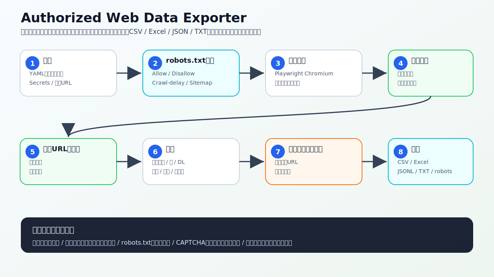
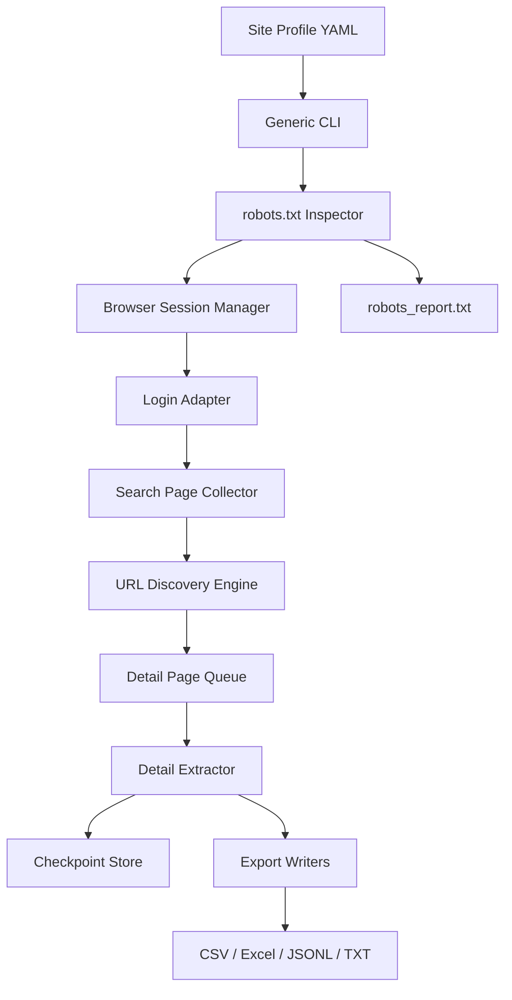

# Authorized Web Data Exporter



## はじめに: このリポジトリが何をするか

このリポジトリは、**ログインが必要なWebサイトから、あなたが正規に閲覧・保存できるデータを、安定してCSV / Excel / JSONL / TXTへエクスポートするための汎用基盤**です。

最初のサイトプロファイルとして、健美家（Kenbiya）のログインURL `https://www.kenbiya.com/app/exe/login` を使う設定例を `profiles/kenbiya.yml` に同梱しています。ただし、設計はKenbiya専用ではありません。別サイトでも、YAMLのサイトプロファイルを追加・変更するだけで使い回せるようにしています。

> 重要: このツールは、利用規約・robots.txt・サイト運営者の許諾・アカウント契約で許可される範囲でのみ使う前提です。CAPTCHA回避、認証回避、IPローテーション、プロキシ悪用、bot検知のすり抜け、アクセス制限突破は実装していません。安定性は、低速アクセス、再開可能設計、重複排除、リトライ、robots.txt確認、エラー保存により高めます。

---

## 最初に見るべき全体像

READMEを開いたときに最初に目に入る上の画像は、GPT Image最新モデルで説明画像を作ることを想定した構成に合わせています。リポジトリには、GitHubでそのまま表示できるSVG版を `docs/assets/architecture-overview.svg` として同梱し、GPT Imageで差し替え用の説明画像を作るための詳細プロンプトを `docs/gpt-image-guidance-prompt.md` に入れています。

上の画像の流れを、初心者向けに文章で丁寧に分解すると次の通りです。

1. **ユーザーが設定するもの**  
   対象サイトのログイン情報、検索結果URL、どのリンクを詳細ページとして扱うか、どの項目を抜き出すかを設定します。GitHub Actionsで動かす場合、ログイン情報はGitHub Secretsに保存します。

2. **robots.txtを最初に確認する**  
   対象ドメインの `/robots.txt` を取得し、User-agent、Allow、Disallow、Crawl-delay、Sitemapを解析します。開始URL、ログインURL、巡回中に見つけたURLがrobots.txt上で許可されるかを判定し、`outputs/robots_report.txt` に保存します。

3. **サイトプロファイルを読み込む**  
   `profiles/kenbiya.yml` のようなYAMLファイルを読み込みます。ここにはログインURL、ログインフォームの候補セレクタ、ログイン成功を判定するセレクタ、検索結果から詳細ページURLを見つけるルール、ページ送りルール、詳細ページで抽出する項目が書かれています。

4. **Playwrightでブラウザを起動する**  
   実ブラウザに近い形でページを開きます。ログイン済みセッションが保存されていれば再利用し、なければ正規のID・パスワードでログインします。

5. **検索結果ページを低速に巡回する**  
   検索結果URLを開き、詳細ページURLと次ページURLを抽出します。並列で一気にアクセスせず、標準では1ページごとに待機時間とランダムなジッターを入れます。

6. **詳細ページを1件ずつ取得する**  
   発見した詳細ページURLをキューに入れ、重複を除外しながら1件ずつ取得します。途中で失敗してもURL・理由・フェーズを保存します。

7. **抽出エンジンがデータ化する**  
   YAMLで指定した項目、ページ内のテーブル、定義リスト、本文、画像URL、リンクURLをまとめて構造化します。未知の項目も `key_values` と `raw_text` に残すため、取りこぼしを減らします。

8. **チェックポイントを保存する**  
   取得済み検索ページ、取得済み詳細ページ、抽出済みレコード、失敗情報を `.crawler-state/checkpoint.json` に保存します。途中で止まっても再実行すれば続きから進められます。

9. **成果物を書き出す**  
   `outputs/` に `records.csv`、`records.xlsx`、`records.jsonl`、`records.txt`、`errors.jsonl`、`robots_report.txt` を生成します。GitHub Actions実行時は artifact としてダウンロードできます。

---

## この基盤の設計思想

### 1. 安定性を最重要視

このツールは、速さよりも安定性を優先します。

- 直列実行でサーバー負荷を抑える
- 各リクエストに待機時間とジッターを入れる
- 失敗時に指数バックオフでリトライする
- チェックポイントで途中再開できる
- 同じURLを二重取得しない
- robots.txtを取得・解析・保存する
- robots.txtで許可されないURLは標準では取得しない
- エラーを消さずに `errors.jsonl` へ残す
- 生HTML保存オプションで後から再解析できる

### 2. 他サイトへ使い回せる汎用アーキテクチャ

Kenbiya固有の処理をコードに埋め込まず、サイト差分はYAMLプロファイルに寄せています。



別サイトを追加する場合は、基本的に次を変えるだけです。

- `login_url`
- ログインフォームのセレクタ候補
- ログイン成功を判定するセレクタ候補
- 詳細ページURLの抽出セレクタまたは正規表現
- 次ページURLの抽出セレクタ
- 詳細ページで欲しい項目のセレクタ
- robots.txtのUser-agent名と強制レベル

### 3. “ブロック回避”ではなく“ブロックされにくい健全運用”

このリポジトリでは、検知回避や制限突破ではなく、以下で安定性を高めます。

- アクセス間隔を十分に空ける
- 並列取得しない
- セッションを再利用して不要なログインを減らす
- リトライ回数を制限する
- CAPTCHAや追加認証が出た場合は停止する
- robots.txtを毎回レポートとして残す
- User-agentを偽装しない
- プロキシローテーションを使わない

---

## リポジトリ構成

```text
.
├── profiles/
│   ├── kenbiya.yml
│   └── example-site.yml
├── src/authorized_web_exporter/
│   ├── cli.py
│   ├── config.py
│   ├── crawler.py
│   ├── parser.py
│   ├── robots.py
│   ├── checkpoint.py
│   ├── storage.py
│   └── models.py
├── scripts/build_runtime_profile.py
├── docs/
│   ├── architecture.md
│   ├── setup.md
│   ├── robots.md
│   ├── gpt-image-guidance-prompt.md
│   ├── github-actions-permission-note.md
│   ├── workflows/
│   │   ├── ci.yml
│   │   └── export.yml
│   └── assets/architecture-overview.svg
├── tests/
└── .devcontainer/
```

---

## すぐ使う方法: ローカル

```bash
git clone https://github.com/YOUR_OWNER/authorized-web-data-exporter.git
cd authorized-web-data-exporter
python -m venv .venv
source .venv/bin/activate  # Windows: .venv\Scripts\activate
pip install -e ".[dev]"
python -m playwright install chromium
cp .env.example .env
```

`.env` を編集します。

```bash
KENBIYA_EMAIL="your-email@example.com"
KENBIYA_PASSWORD="your-password"
WEB_EXPORT_ACKNOWLEDGE_AUTHORIZED="true"
```

`profiles/kenbiya.yml` の `start_urls` に、ブラウザでログイン後に表示できる検索結果URLを貼ります。

```yaml
start_urls:
  - "https://www.kenbiya.com/...検索結果URL..."
```

実行します。

```bash
web-export export --profile profiles/kenbiya.yml --output-dir outputs --acknowledge-authorization
```

robots.txtだけ確認する場合:

```bash
web-export robots --profile profiles/kenbiya.yml --url https://www.kenbiya.com/app/exe/login
```

---

## GitHub Actionsについて

このリポジトリには、CI用とエクスポート用のworkflowテンプレートを以下に保存しています。

- `docs/workflows/ci.yml`
- `docs/workflows/export.yml`

今回の自動コミット環境では、`.github/workflows/` へのファイル作成だけがGitHub API 404で拒否されました。これはアプリ本体・テスト・ドキュメントのpushとは別で、workflowファイルを書き込む権限がないGitHub tokenやGitHub Appで起きる典型的な制限です。

workflow作成権限がある環境では、同じ内容を `.github/workflows/ci.yml` と `.github/workflows/export.yml` に置くと、以下が有効になります。

- push / pull_request / workflow_dispatchでのlint・test CI
- `workflow_dispatch` からの手動エクスポート
- `authorized-web-export-outputs` artifactへのCSV/Excel/JSON/TXT/robots_report保存

---

## robots.txt確認について

実行時には必ず対象ドメインの `/robots.txt` を確認し、次を `outputs/robots_report.txt` に保存します。

- robots.txt URL
- 取得ステータス
- User-agentごとのAllow/Disallow
- Crawl-delay
- Sitemap
- 開始URL・ログインURL・巡回URLごとの許可判定
- robotsで拒否されたためスキップしたURL

Kenbiyaのログインページについては、ChatGPTの確認環境ではページ本文取得がrobots.txtにより拒否されました。そのため、このリポジトリではKenbiyaを含むすべてのサイトで、実行時にrobots.txtを必ず取得し、結果をレポート化する設計にしています。

---

## 他サイトへ使い回す方法

1. `profiles/example-site.yml` をコピーします。
2. `name`、`login_url`、`allowed_domains`、`credential_env` を変更します。
3. `start_urls` に検索結果URLや一覧URLを入れます。
4. `login_selectors` を対象サイトのログインフォームに合わせます。
5. `discovery.detail_link_selectors` と `discovery.detail_url_regexes` を対象サイトの詳細ページURLに合わせます。
6. `fields` に欲しい項目を追加します。
7. `web-export export --profile profiles/your-site.yml --acknowledge-authorization` を実行します。

---

## 出力ファイル

| ファイル | 内容 |
|---|---|
| `records.csv` | 横持ちCSV。主要項目と抽出項目を列化 |
| `records.xlsx` | Excel。records、fields_long、key_values_long、images、links、errorsの複数シート |
| `records.jsonl` | 1レコード1行のJSON Lines |
| `records.txt` | 人間が読みやすいテキスト形式 |
| `errors.jsonl` | 取得失敗URLと理由 |
| `robots_report.txt` | robots.txt取得・解析・許可判定レポート |
| `raw_html/` | `save_html: true` の場合だけHTML保存 |

---

## 本番運用に必要なもの

- 対象サイトの正規アカウント
- 対象データの取得・保存が利用規約・契約・権限上許可されていること
- GitHub Actionsで動かす場合はRepository Secrets
- 検索結果URLまたは一覧URL
- 対象サイトに合わせたYAMLプロファイル
- 大量取得する場合は十分な低速設定

---

## テスト

```bash
pytest
ruff check .
```

---

## 注意事項

このツールは、アカウント所有者自身が閲覧できる情報を保存するための補助ツールです。サイトのアクセス制御、レート制限、CAPTCHA、ログイン制限、robots.txt、利用規約を回避する用途には使わないでください。
