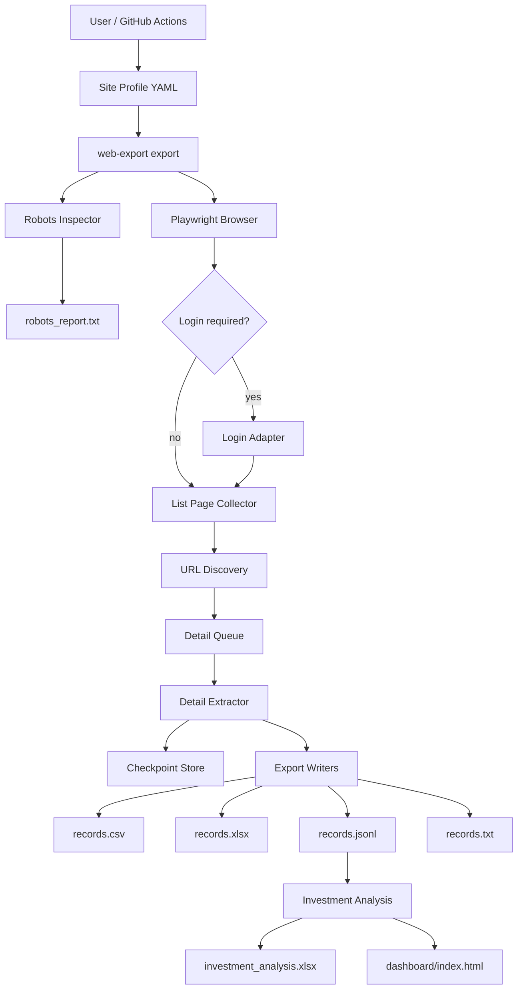
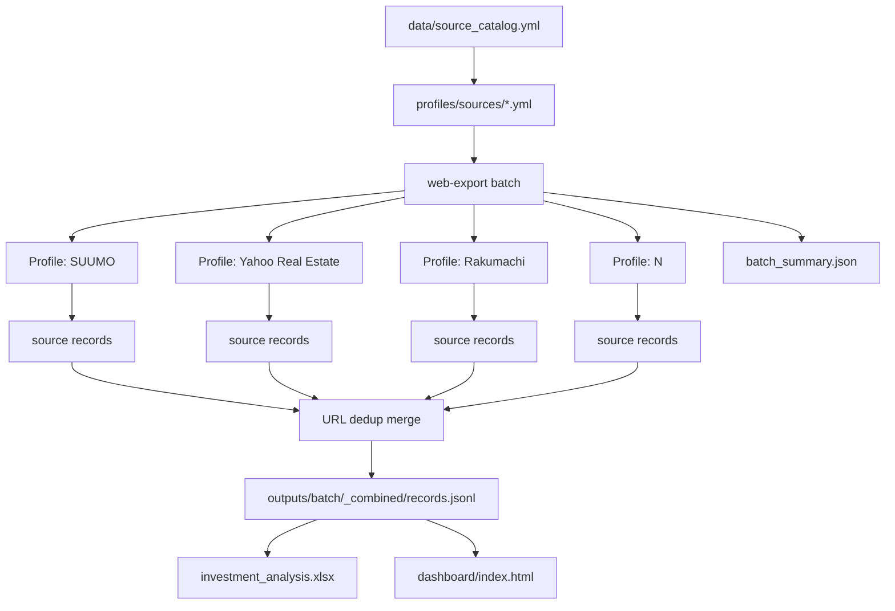

# アーキテクチャ詳細

このプロジェクトは、Kenbiya専用スクリプトではなく、ログイン型サイト・公開HTMLサイト・公的API・賃貸相場・競売/公売・ハザード/地価を横断的に扱う、不動産投資向けデータ収集基盤です。

## 単一ソース処理

## 複数ソース一括処理

## 処理プロシージャ

1. `data/source_catalog.yml` で対応ソース一覧を管理する。
2. `profiles/sources/*.yml` で各サイトの開始URL、ドメイン、リンク発見ルール、抽出項目を管理する。
3. `web-export batch` がプロファイルを順番に読み込む。
4. ログイン不要サイトは直接一覧URLへ進む。
5. ログイン必須サイトは保存済みセッションまたは認証情報でログインする。
6. 対象ドメインのrobots.txtを取得・保存する。
7. 一覧ページから詳細ページURLと次ページURLを抽出する。
8. 詳細ページを1件ずつ取得する。
9. テーブル、定義リスト、本文、画像、リンクを保存する。
10. 各ソースごとに `records.jsonl`、CSV、Excel、TXTを生成する。
11. バッチ処理では全ソースの `records.jsonl` をURL重複除外して `_combined/records.jsonl` に統合する。
12. 統合データから投資分析Excelを1シートで生成する。
13. 同じ統合データからWebダッシュボードを生成する。
14. `batch_summary.json` にソース別成功/失敗、件数、統合出力先を保存する。

## 安定性のための設計

- 直列実行
- 待機時間とランダムジッター
- リトライと指数バックオフ
- robots.txtの実行前確認
- 再開可能なチェックポイント
- エラーの永続化
- 生HTML保存オプション
- サイト差分をYAMLプロファイルに集約
- URLベースの統合重複除外
- 投資分析側の物件属性ベース重複判定

## 対応ソースの管理

対応ソース一覧は以下を参照してください。

- `data/source_catalog.yml`
- `docs/source_catalog.md`
- `profiles/sources/`

## 拡張方法

新しいサイトを追加するときは、`profiles/example-site.yml` をコピーし、ログイン有無、開始URL、詳細リンク抽出ルール、抽出フィールドを対象サイトに合わせます。コード本体は変更しない方針です。
