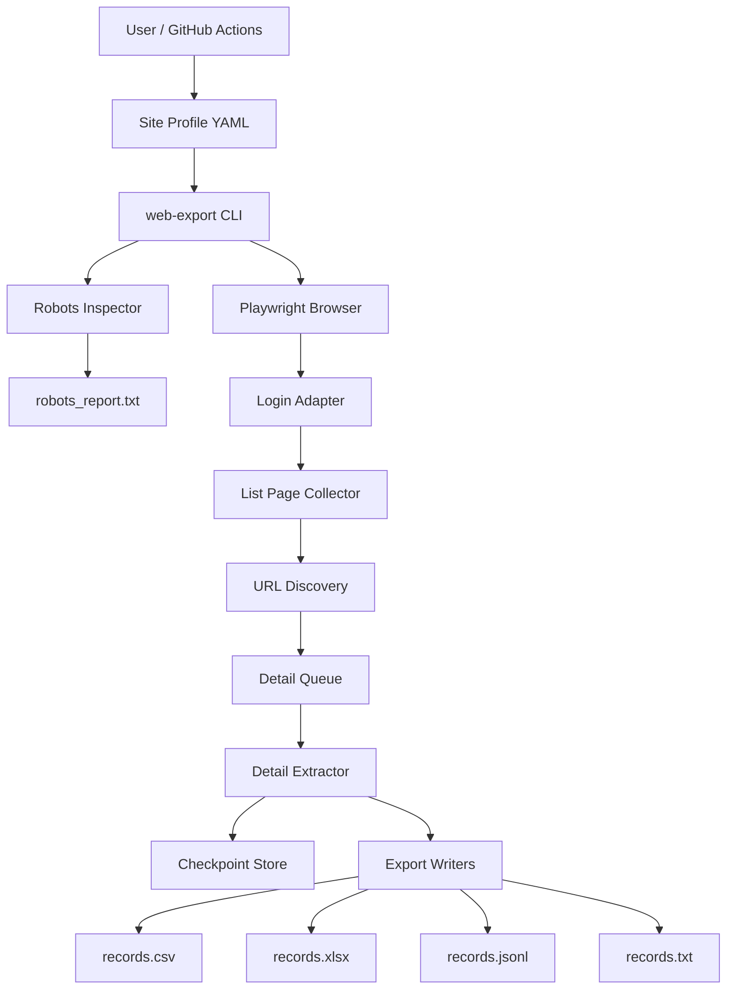

# アーキテクチャ詳細

このプロジェクトは、Kenbiya専用スクリプトではなく、ログイン型サイト向けの汎用データエクスポート基盤です。

## コンポーネント

## 処理プロシージャ

1. YAMLプロファイルを読み込む。
2. 認可確認フラグと認証情報を確認する。
3. 対象ドメインのrobots.txtを取得する。
4. ログインURLと開始URLがrobots.txt上で許可されるか判定する。
5. Playwright Chromiumを起動する。
6. 保存済みセッションがあれば再利用する。
7. 未ログインならログインフォームを探して入力する。
8. CAPTCHA、MFA、追加認証らしき文言が出た場合は停止する。
9. 開始URLを低速に開く。
10. 詳細ページURLと次ページURLを抽出する。
11. 詳細ページURLを重複排除してキューに入れる。
12. 次ページURLを重複排除して一覧ページキューに入れる。
13. 詳細ページを1件ずつ低速に開く。
14. セレクタ指定項目、テーブル、定義リスト、本文、画像、リンクを抽出する。
15. 1件ごとにチェックポイントへ保存する。
16. 最後にCSV、Excel、JSONL、TXT、robots_reportを出力する。

## 安定性のための設計

- 直列実行
- 待機時間とランダムジッター
- リトライと指数バックオフ
- robots.txtの実行前確認
- 再開可能なチェックポイント
- エラーの永続化
- 生HTML保存オプション
- サイト差分をYAMLプロファイルに集約

## 拡張方法

新しいサイトを追加するときは、`profiles/example-site.yml` をコピーし、ログインセレクタ、詳細リンク抽出ルール、抽出フィールドを対象サイトに合わせます。コード本体は変更しない方針です。
