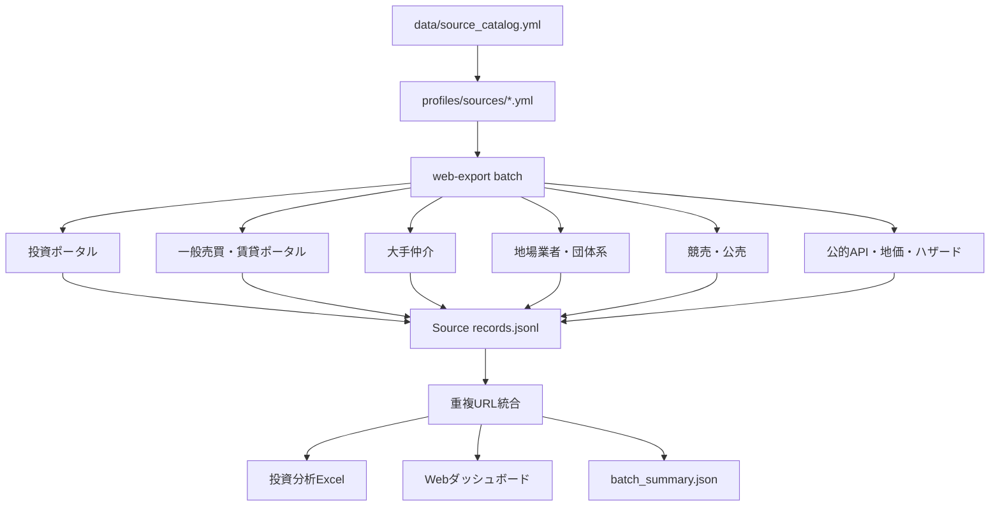

# 日本全国の不動産情報を横断収集するバッチ収集アーキテクチャ

このプロジェクトは、単一サイトのスクレイピングではなく、日本の不動産投資に必要な情報を複数ソースから横断収集する構成に拡張されています。

## 全体像



## 正となる管理ファイル

### `data/source_catalog.yml`

対応している情報源のマスターカタログです。

主な項目:

- サイト名
- カテゴリ
- URL
- 取得しやすさ
- 物件監視向き
- 優先度
- 取得方式
- 対応プロファイル
- 取得候補データ
- 備考

### `profiles/sources/*.yml`

各サイトを実際に巡回するためのプロファイルです。

主な項目:

- `login_required`
- `allowed_domains`
- `start_urls`
- `rate_limit`
- `limits`
- `discovery.detail_link_selectors`
- `discovery.detail_url_regexes`
- `extraction.fields`

## 一括収集コマンド

全プロファイルを順番に実行します。

```bash
web-export batch \
  --profile-dir profiles/sources \
  --output-root outputs/batch \
  --acknowledge-authorization
```

特定サイトだけ実行します。

```bash
web-export batch \
  --profile-dir profiles/sources \
  --include suumo \
  --include yahoo-realestate \
  --include rakumachi \
  --include rals-invest \
  --output-root outputs/batch \
  --acknowledge-authorization
```

## 出力構成

```text
outputs/batch/
├── suumo/
│   ├── records.jsonl
│   ├── records.csv
│   ├── records.xlsx
│   ├── errors.jsonl
│   └── robots_report.txt
├── yahoo-realestate/
├── rakumachi/
├── ...
├── _combined/
│   ├── records.jsonl
│   ├── investment_analysis.xlsx
│   ├── analysis_summary.txt
│   ├── analysis_summary.json
│   └── dashboard/index.html
└── batch_summary.json
```

## 取得対象カテゴリ

### 投資物件ポータル

- 健美家
- 楽待
- LIFULL HOME'S 不動産投資
- 投資アットホーム
- 不動産投資連合隊
- RALS / CBIZ系
- ノムコム・プロ
- 住友不動産ステップPRO
- 三井不動産リアルティPRO

### 一般売買・賃貸ポータル

- SUUMO
- Yahoo!不動産
- LIFULL HOME'S
- at home
- Nifty不動産
- goo住宅・不動産
- オウチーノ
- スマイティ
- ホームアドパーク

### 大手仲介

- 三井のリハウス
- 住友不動産販売 / ステップ
- 東急リバブル
- ノムコム
- 三菱UFJ不動産販売 / 住まい1
- 三菱地所の住まいリレー
- 大成有楽不動産販売
- みずほ不動産販売
- 住友林業ホームサービス
- 三井住友トラスト不動産
- 大京穴吹不動産

### 地場業者・団体系

- センチュリー21
- ピタットハウス
- ハトマークサイト
- 不動産ジャパン

### 公的・相場・リスク補完

- 国交省 不動産情報ライブラリ
- 国税庁 路線価図・評価倍率表
- ハザードマップポータルサイト
- 地理院地図
- e-Stat
- RESAS

### 競売・公売・商業用

- BIT 不動産競売物件情報
- KSI官公庁オークション
- 981.jp
- CBRE
- JLL物件情報

### 賃料相場補完

- いい部屋ネット
- CHINTAI
- アパマンショップ
- スモッカ

## 実装済みプロファイル数

`profiles/sources/` に、公開HTML監視用のプロファイルを多数配置しています。各サイトは同じ汎用クローラーで動き、HTML内のテーブル、定義リスト、本文、画像、リンクを保存します。

## 投資分析への連携

各サイトの生データは `records.jsonl` に保存されます。バッチ終了後、全ソースのURL重複を除外して `_combined/records.jsonl` に統合し、以下を自動生成します。

- `_combined/investment_analysis.xlsx`
- `_combined/dashboard/index.html`
- `_combined/analysis_summary.txt`
- `_combined/analysis_summary.json`

## 追加サイトの増やし方

1. `data/source_catalog.yml` に1行追加します。
2. `profiles/sources/example-site.yml` を参考にプロファイルを作ります。
3. `allowed_domains`、`start_urls`、`detail_link_selectors`、`detail_url_regexes` を設定します。
4. `web-export batch --include <profile-name>` で単体検証します。
5. 問題なければ通常のバッチ対象に入れます。
