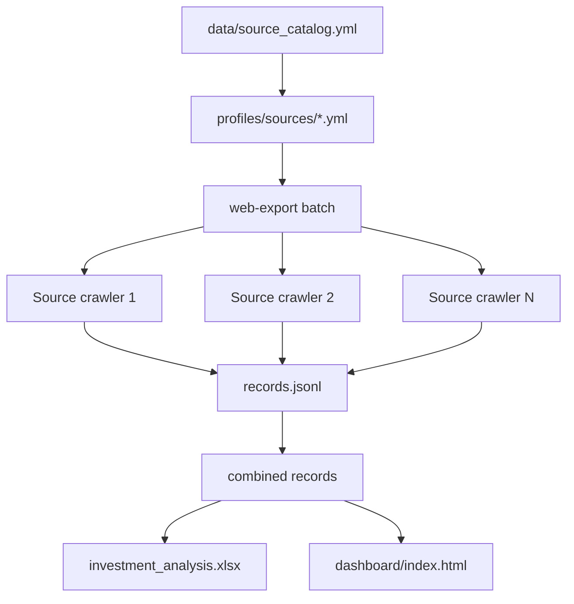

# 日本の不動産投資向け 情報収集ソースカタログ

このドキュメントは、`data/source_catalog.yml` の人間向け説明版です。ゴールは、日本の不動産投資に必要な情報を、物件ポータル・大手仲介・公的API・ハザード・地価・競売/公売・賃貸相場から横断的に集めることです。

## 基本アーキテクチャ



## 優先順位

- S: 投資判断の中核。最優先で監視する。
- A: 収集価値が高い。Sの補完として常時監視。
- B: エリア・種別によって有効。補助監視。
- C: 相場補完・家賃補完・周辺確認。
- X: 原則として自動取得対象外。

## 取得元一覧

| 優先 | サイト | 取得しやすさ | 物件監視向き | プロファイル | 役割 |
|---:|---|---|---|---|---|
| S | 国交省 不動産情報ライブラリ | A | ◎ | builtin_reinfolib_api | 公式API。相場・地価・成約価格の土台 |
| S | SUUMO | A-〜B | ◎ | `profiles/sources/suumo.yml` | 新着メール/RSS/売買/賃貸/相場補完 |
| A | LIFULL HOME'S | B〜C | ○ | `profiles/sources/lifull-homes.yml` | 売買・賃貸・家賃相場・アーカイブ |
| S | LIFULL HOME'S 不動産投資 | B〜C | ◎ | `profiles/sources/lifull-homes-investment.yml` | 収益物件・投資用 |
| A | at home | B | ○ | `profiles/sources/athome.yml` | 投資・居住用・事業用 |
| A | 投資アットホーム | B | ◎ | `profiles/sources/toushi-athome.yml` | 投資用収益物件 |
| S | Yahoo!不動産 | A-〜B | ◎ | `profiles/sources/yahoo-realestate.yml` | 地域別・条件別の公開HTML監視 |
| S | Nifty不動産 | A-〜B | ◎ | `profiles/sources/nifty-realestate.yml` | 横断検索・掲載元確認 |
| A | goo住宅・不動産 | B | ○ | `profiles/sources/goo-house.yml` | 横断チェック補助 |
| S | 楽待 | B | ◎ | `profiles/sources/rakumachi.yml` | 一棟・区分・投資用物件 |
| S | 健美家 | B | ◎ | `profiles/kenbiya.yml` | 投資用物件・相場レポート |
| S | 不動産投資連合隊 | A-〜B | ◎ | `profiles/sources/rals-invest.yml` | 地方・一棟・投資用 |
| A | RALS / CBIZ系 | A-〜B | ○ | `profiles/sources/cbiz-invest.yml` | 地方投資物件・事業用 |
| A | 三井のリハウス | B | ○ | `profiles/sources/mitsui-rehouse.yml` | 大手仲介の価格・新着監視 |
| A | 三井不動産リアルティPRO | B | ◎ | `profiles/sources/mitsui-rehouse-pro.yml` | 投資・事業用監視候補 |
| A | 住友不動産販売 / ステップ | B | ○ | `profiles/sources/sumitomo-step.yml` | 公開一覧・新着監視 |
| A | 住友不動産ステップPRO | B | ◎ | `profiles/sources/sumitomo-step-pro.yml` | 事業用・投資用 |
| A | 東急リバブル | B〜C | ○ | `profiles/sources/tokyu-livable.yml` | 売買・事業用・投資用 |
| A | ノムコム | B〜C | ○ | `profiles/sources/nomu.yml` | 大手仲介売買 |
| S | ノムコム・プロ | B〜C | ◎ | `profiles/sources/nomu-pro.yml` | 投資用・事業用 |
| A | 三菱UFJ不動産販売 / 住まい1 | A-〜B | ○ | `profiles/sources/sumai1.yml` | 大手仲介売買 |
| A | 三菱地所の住まいリレー | A-〜B | ○ | `profiles/sources/mec-h.yml` | 中規模監視 |
| B | 大成有楽不動産販売 | B暫定 | ○ | `profiles/sources/ietan.yml` | 追加検証対象 |
| B | みずほ不動産販売 | B暫定 | ○ | `profiles/sources/mizuho-re.yml` | 新着・価格変更監視 |
| B | 住友林業ホームサービス | B暫定 | ○ | `profiles/sources/suminavi.yml` | 仲介補完 |
| B | 三井住友トラスト不動産 | B暫定 | ○ | `profiles/sources/smtrc.yml` | 富裕層・相続・土地系 |
| B | 大京穴吹不動産 | B | ○ | `profiles/sources/daikyo-anabuki.yml` | 区分マンション監視 |
| B | センチュリー21 | B | ○ | `profiles/sources/century21.yml` | 加盟店横断・地方補完 |
| B | ピタットハウス | B | ○ | `profiles/sources/pitat.yml` | 居住用・投資用補完 |
| A | ハトマークサイト | B | ○ | `profiles/sources/hatomark.yml` | 地場業者情報 |
| A | 不動産ジャパン | B | ○ | `profiles/sources/fudousan-japan.yml` | 業界団体系の網羅補助 |
| X | REINS | D | × | なし | 原則スクレイピング対象外。公的API等で代替 |
| A | 国税庁 路線価図 | C | ○ | `profiles/sources/nta-rosenka.yml` | 積算評価・担保評価補完 |
| S | ハザードマップポータル | C | ◎ | `profiles/sources/hazard-gsi.yml` | 洪水・土砂・津波などのリスク補完 |
| A | 地理院地図 | B | ○ | `profiles/sources/gsi-maps.yml` | 地形・標高・空中写真 |
| A | e-Stat | A-〜B | ◎ | builtin_estat_api_future | 人口・世帯・需要補完 |
| A | RESAS | A-〜B | ◎ | builtin_resas_api_future | 地域経済・人口動態補完 |
| A | BIT 不動産競売物件情報 | C | ◎ | `profiles/sources/bit-court-auction.yml` | 競売案件 |
| B | KSI官公庁オークション | B | ○ | `profiles/sources/ksi-auction.yml` | 公売案件 |
| B | 981.jp | B | ○ | `profiles/sources/981.yml` | 競売情報補完 |
| B | CBRE | B | ○ | `profiles/sources/cbre.yml` | 事業用・商業用 |
| B | JLL物件情報 | B | ○ | `profiles/sources/jll-property.yml` | 商業用・物流・オフィス |
| C | いい部屋ネット | B | ○ | `profiles/sources/eheya.yml` | 家賃相場補完 |
| C | CHINTAI | B | ○ | `profiles/sources/chintai.yml` | 家賃相場補完 |
| C | アパマンショップ | B | ○ | `profiles/sources/apamanshop.yml` | 家賃相場補完 |
| C | スモッカ | B | ○ | `profiles/sources/smocca.yml` | 賃貸横断補完 |
| C | ホームアドパーク | B | ○ | `profiles/sources/adpark.yml` | 売買・賃貸補完 |
| C | オウチーノ | B | ○ | `profiles/sources/ouchiino.yml` | 売買・賃貸補完 |
| C | スマイティ | B | ○ | `profiles/sources/sumaity.yml` | 家賃・相場補完 |

## 一括取得

すべてのサイトプロファイルを順番に実行します。

```bash
web-export batch --profile-dir profiles/sources --output-root outputs/batch --acknowledge-authorization
```

一部だけ実行する場合:

```bash
web-export batch --profile-dir profiles/sources --include suumo --include yahoo-realestate --include rakumachi --output-root outputs/batch --acknowledge-authorization
```

統合出力:

```text
outputs/batch/_combined/records.jsonl
outputs/batch/_combined/investment_analysis.xlsx
outputs/batch/_combined/dashboard/index.html
outputs/batch/batch_summary.json
```

## 取得する情報

全ソースで取得できる限り以下に寄せます。

- 物件名
- 種別
- 都道府県
- 市区町村
- 所在地
- 最寄駅
- 駅徒歩分数
- 価格
- 土地面積
- 建物面積
- 構造
- 築年/築年月/築年数
- 総戸数
- 階数
- 権利
- 取引態様
- 売主/仲介会社
- 担当者
- 連絡先
- 初回掲載
- 詳細URL
- 表面利回り
- 想定家賃収入
- ハザード
- 路線価/地価/成約価格/API比較価格

未取得の場合は空欄ではなく、分析Excel側で未取得理由を入れます。
